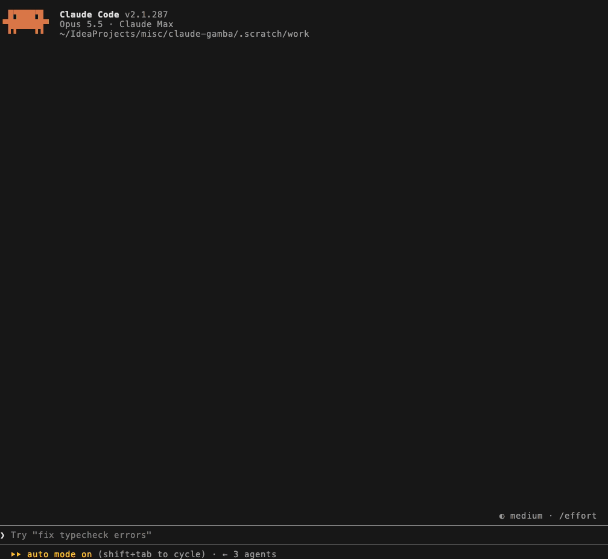

<div align="center">

# 🎰 claude-gamba

### A slot machine inside Claude Code.<br>You spin while your agent works. Chips come only from the tokens it burns.

**No real money.** No payments, no deposits, no casino links. This is satire:<br>the only thing you can lose here is tokens, and you were burning those anyway.


**English** · [Русский](README.ru.md)



<sub>A real session on Opus 5.5. The reels in this take were told what to land on: nobody films a slot machine until it pays.</sub>

</div>

## Install

In a Claude Code session:

```
/plugin install gamba --marketplace salatmaster/claude-gamba
```

Then give your agent something to do. A line above the prompt will ask whether you want to test your luck. You do.

<sub>Needs Claude Code 2.1.287 or later, where mods start. From a shell: `claude plugin marketplace add salatmaster/claude-gamba && claude plugin install gamba@claude-gamba`. From a clone, for one session: `claude --plugin-dir ./claude-gamba`.</sub>

## The deal

You can't buy chips. You can't get them for free. Your agent burns tokens, the tokens become chips, the chips become nothing. The machine pays back 74%, so you will run out, and then you will have to write another prompt. Some call this a job.

| | |
| :- | :- |
| 🔥 **Chips are burned tokens** | One chip per 2,000 tokens your agent spends, paid out while it is still working. There is no other way in. |
| 🗯 **It has opinions** | Over a hundred deadpan lines per language. English and Russian are written separately; neither is a translation. |
| 📈 **It keeps score on you** | Hours waited on the agent, tokens deposited, longest losing streak, rank. One key copies it for the group chat. |

## What it says

| When | It says |
| :- | :- |
| The agent starts working | *Waiting on Claude. Test your luck?* |
| You spin | *Let's go gambling!* |
| You miss | *Aw dangit* |
| You miss seven times running | *7 misses in a row. Statistically you're due (you're not)* |
| Three of a kind | *I MADE IT BIG!!! 🤑🤑🤑* |
| You run out of chips | *90% of gamblers quit right before they hit big* |
| The agent pays you | *Your agent just funded your habit* |
| The agent finishes | *It finished. You didn't* |
| 80% of your weekly limit is gone | *Please gamble responsibly (lol)* |

And the line `4` puts on your clipboard:

> This week: waited 6.4h on my agent, 212 spins, 1,904,220 tokens deposited. Rank: Redepositor

## How to play

`/gamba` opens the slot at any moment, also in the middle of a turn; `/ludka` is the same command under its Russian name. Everything else is a digit, so it works on any keyboard layout.

| Key | What it does |
| :- | :- |
| <kbd>1</kbd> or <kbd>Enter</kbd> | Spin |
| <kbd>2</kbd> <kbd>3</kbd> | Bet down, bet up. A click on a number picks it outright |
| <kbd>4</kbd> | Copy your stats as one line |
| <kbd>5</kbd> | Language: auto, English, Russian |
| <kbd>6</kbd> | Sound on or off |
| <kbd>7</kbd> | Auto-open: ask, always, never |
| <kbd>8</kbd> | Close |
| <kbd>Esc</kbd> | Keyboard back to the prompt. The slot stays; `/gamba` takes the keys again |

You keep typing, the agent keeps working. The slot never takes the keyboard unless you asked for it.

## The machine

Three reels. The middle row, between the arrows, is the one that counts, read from the left.

| Reels | Pays, per chip bet |
| :- | :- |
| 🚀 🚀 🚀 shipped | 200 |
| ✅ ✅ ✅ tests green | 50 |
| 🍕 🍕 🍕 pizza night | 25 |
| 🐛 🐛 🐛 | 10 |
| 🔥 🔥 🔥 prod is on fire, 💀 💀 💀 | 6 |
| the first two match | 2 |

The bet is 1, 2, 3, 5, 10, 15, 20 or 25 chips, and a win is the payout times the bet. With fewer chips than the bet, the spin goes all in with what you have.

One spin in five pays anything. The return is 73.9%, computed exactly over all 8,000 outcomes and checked on 300,000 spins in the tests. The house edge is not a bug.

## Chips

One chip per 2,000 burned tokens, at most 20 chips per agent turn. Chips land after every model request, so a long turn pays out while it is still running. Subagents' tokens count.

"Burned" is input + output + cache-write tokens. Cache reads are left out: every tool call re-reads the same context, and counting it twenty times is how you get thousands of spins a turn. On about 1,400 real turns this rate gives a median of 8 chips per turn.

Both numbers, and the limit warning threshold, are rows in `/config`.

## Stats

Kept between sessions in Claude Code's own plugin store on your machine. Nothing is sent anywhere: the mod makes no network calls, and `claude plugin validate` on a clone lists everything it touches.

| Stat | What is counted | Window |
| :- | :- | :- |
| Waited on agent | Wall-clock time of your agent's turns in the main conversation | This week |
| Spins | Spins | This week |
| Tokens deposited | Burned tokens, as defined above | This week |
| Biggest win | The largest single win, in chips | All time |
| Miss streak | The longest run of misses | All time |
| Payout | Chips won over chips bet | All time |
| Rank | By all-time spins: Tourist, Degen at 10, Redepositor at 100, High roller at 500, The house at 2,000 | All time |

The week turns over on Monday, 00:00 UTC. `/gamba stats` prints the same line as text, for places that draw no panes.

## The fine print

<details>
<summary><b>When it shows up</b></summary>

While the agent works and the slot is shut, one line above the prompt asks whether to open it: `1` yes, `2` no, `3` always open, `4` don't offer. The digits work straight from an empty prompt. Ignore the line and it leaves with the turn.

"Always" opens the slot by itself every time the agent starts, without taking the keyboard, and closing it does not undo the choice. Claude Code seats a pane nobody asked for only in a terminal 110 columns or wider; in a narrower one you get a yes/no line instead. `7` in the slot changes the same setting, which is the way back from "don't offer".

</details>

<details>
<summary><b>It fits the room it gets</b></summary>

In a tall sidebar it is the whole cabinet from the recording. As the sidebar gets shorter it sheds one part at a time: the paytable, the sign, the blank rows, and then the balance moves next to the reels and the stats fold into two lines. Above the prompt the reels, the balance and the records sit side by side. Only a pane under 34 columns falls back to a plain column.

The sidebar needs Claude Code's fullscreen layout and a terminal 110 columns or wider. Otherwise the slot sits above the prompt.

</details>

<details>
<summary><b>Language</b></summary>

English, unless your prompts are in Cyrillic: then Russian, and it stays Russian. `5` overrides.

</details>

<details>
<summary><b>Sound</b></summary>

A clack per reel, a coin for a pair, a fanfare for three and a sad one for an empty balance. It plays on macOS only: Claude Code has no player elsewhere. The clips are generated by `sounds/make.mjs`, no samples from anywhere. `6` mutes.

</details>

<details>
<summary><b>The warning</b></summary>

At 80% of your weekly plan limit you get one toast per week. It is not helpful.

</details>

## Add a phrase or a language

Every phrase is a line in `locales/en.ts` or `locales/ru.ts`. A meme that died: delete its line. A new one: add a line.

A new language is one file. Copy `locales/en.ts`, write it natively (do not translate, the jokes will not survive), and add it to `LOCALES` in `locales/index.ts`. Give it a `detect` pattern if prompts in that language are recognisable by script.

House rules, enforced by the tests where a test can: 60 characters at most, deadpan, never explain the joke, never repeat twice in a row, no names of real people, no brands, no links.

## Not in here

Bets on what the agent will do, crash games, blackjack, roulette, leaderboards, anything over the network. And money, in any form.

## Develop

```
claude --plugin-dir .                             # load it, hot-reloads on save
claude plugin validate .claude-plugin/plugin.json # what Claude Code reads from it
claude plugin test .                              # the tests, no session needed
```

No dependencies and no build step. Written and checked against Claude Code 2.1.287 in a terminal. The Desktop app draws the same pane, but there it has only been checked by the test kit, not by eye. The mods API is early access and may move between releases.

If the tests answer `hooks modules are turned off in this process`, that is Anthropic's remote switch for mods, not this repo. It comes back on by itself.
