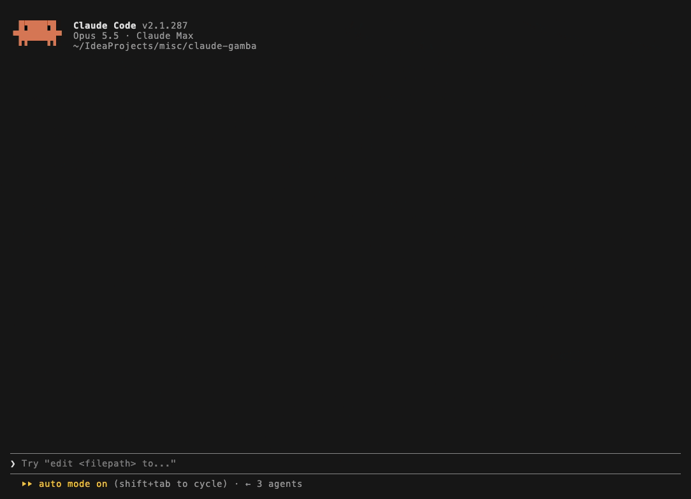

<div align="center">

# 🎰 claude-gamba

### Слот прямо в Claude Code.<br>Крутишь, пока агент думает. Фантики — только за токены, которые он сжёг.

**Реальных денег здесь нет.** Ни платежей, ни депозитов, ни ссылок на казино. Это сатира:<br>проиграть можно только токены, а их ты и так жёг.


[English](README.md) · **Русский**



<sub>Настоящая сессия на Opus 5.5. Барабанам в этом дубле заранее сказали, что выдать: автомат снимают до тех пор, пока не даст.</sub>

</div>

## Установка

В сессии Claude Code:

```
/plugin install gamba --marketplace salatmaster/claude-gamba
```

Дальше дай агенту задачу. Над промптом появится строка с вопросом, не проверить ли удачу. Проверить.

<sub>Нужен Claude Code 2.1.287 или новее: моды появились там. Из шелла: `claude plugin marketplace add salatmaster/claude-gamba && claude plugin install gamba@claude-gamba`. Из клона, на одну сессию: `claude --plugin-dir ./claude-gamba`.</sub>

## Условия

Фантики нельзя купить. Нельзя получить просто так. Агент жжёт токены, токены становятся фантиками, фантики становятся ничем. Аппарат отдаёт 74%, так что баланс кончится и придётся писать следующий промпт. В народе это называется «работать на додеп».

| | |
| :- | :- |
| 🔥 **Фантики — это сожжённые токены** | Фантик за каждые 2 000 токенов, которые потратил агент. Капает, пока он ещё работает. Другого входа нет. |
| 🗯 **У аппарата есть мнение** | Больше сотни фраз с каменным лицом на каждом языке. Русский и английский написаны отдельно, это не перевод. |
| 📈 **Он ведёт учёт на тебя** | Сколько прождал агента, сколько депнул токенов, самая длинная серия мимо, ранг. Одна клавиша — и строка летит в чат. |

## Что он говорит

| Когда | Что говорит |
| :- | :- |
| Агент ушёл работать | *Пока ждёшь Клода — проверим удачу?* |
| Крутишь | *Крутим бурмалду* |
| Мимо | *Плаки-плаки* |
| Семь раз мимо подряд | *7 мимо подряд. По статистике следующий — тоже* |
| Три в ряд | *ЗАНОС* |
| Фантики кончились | *Нужен додеп — взял микрозайм и заложил часы бати в ломбард* |
| Агент начислил | *Агент наработал тебе на додеп* |
| Агент закончил | *Он закончил. Ты — нет* |
| Ушло 80% недельного лимита | *Депнуто 80% недельного лимита. Играй ответственно (нет)* |

А это `4` кладёт в буфер обмена:

> За неделю: прождал агента 6,4 ч, сделал 212 спинов, депнул 1 904 220 токенов. Ранг: Додепщик

## Как играть

`/ludka` открывает слот в любой момент, в том числе посреди хода агента; `/gamba` — та же команда. Всё остальное — цифры, так что русская раскладка не мешает.

| Клавиша | Что делает |
| :- | :- |
| <kbd>1</kbd> или <kbd>Enter</kbd> | Крутить |
| <kbd>2</kbd> <kbd>3</kbd> | Ставка ниже, ставка выше. Клик по числу выбирает его сразу |
| <kbd>4</kbd> | Скопировать стату одной строкой |
| <kbd>5</kbd> | Язык: авто, английский, русский |
| <kbd>6</kbd> | Звук |
| <kbd>7</kbd> | Автооткрытие: спрашивать, всегда, никогда |
| <kbd>8</kbd> | Закрыть |
| <kbd>Esc</kbd> | Клавиатура возвращается в промпт. Слот остаётся; `/ludka` снова отдаёт ему клавиши |

Ты печатаешь, агент работает, аппарат ждёт. Клавиатуру слот забирает, только если ты сам его позвал.

## Аппарат

Три барабана. Считается средний ряд, между стрелками, слева направо.

| Выпало | Платит, на фантик ставки |
| :- | :- |
| 🚀 🚀 🚀 выкатили | 200 |
| ✅ ✅ ✅ тесты зелёные | 50 |
| 🍕 🍕 🍕 пицца за переработку | 25 |
| 🐛 🐛 🐛 | 10 |
| 🔥 🔥 🔥 прод горит, 💀 💀 💀 | 6 |
| первые два совпали | 2 |

Ставка — 1, 2, 3, 5, 10, 15, 20 или 25 фантиков, выигрыш — выплата, умноженная на ставку. Если фантиков меньше ставки, спин идёт на всё, что есть.

Даёт каждый пятый спин. Отдача 73,9%: посчитана точно по всем 8 000 исходов и проверена в тестах на 300 000 спинов. Да, казик подкручен. Нет, не в твою сторону.

## Откуда фантики

Фантик за каждые 2 000 сожжённых токенов, не больше 20 за ход агента. Капает после каждого запроса к модели, так что долгий ход кормит аппарат, пока ещё идёт. Токены субагентов тоже в счёт.

«Сожжённые» — это input, output и запись в кэш. Чтение из кэша не считается: один и тот же контекст перечитывается на каждом вызове инструмента, и если считать его двадцать раз, спинов будет тысячи. На 1 400 реальных ходах такой курс даёт в медиане 8 фантиков за ход.

При установке мод ни о чём не спрашивает. Курс, потолок и порог предупреждения меняются потом: `/ludka rate 500`, `/ludka cap 50`, `/ludka warn 90`. `/ludka config` показывает, что стоит сейчас.

## Стата

Хранится между сессиями в собственном хранилище плагинов Claude Code, на твоей машине. Никуда не отправляется: в сеть мод не ходит совсем, а `claude plugin validate` на клоне покажет всё, к чему он прикасается.

| Что | Как считается | За сколько |
| :- | :- | :- |
| Прождал агента | Сколько длились ходы агента в основном диалоге, по часам | Неделя |
| Спинов | Спины | Неделя |
| Депнуто токенов | Сожжённые токены, см. выше | Неделя |
| Макс. занос | Самый большой выигрыш за спин, в фантиках | Всё время |
| Серия мимо | Самая длинная серия без выигрыша | Всё время |
| Отдача | Выиграно фантиков к поставленным | Всё время |
| Ранг | По спинам за всё время: Бездеп, с 10 — Лудик, со 100 — Додепщик, с 500 — Катала, с 2 000 — Король бурмалды | Всё время |

Неделя начинается в понедельник, 00:00 UTC. `/ludka stats` печатает ту же строку текстом — там, где панели не рисуются.

## Мелким шрифтом

<details>
<summary><b>Когда он появляется</b></summary>

Пока агент работает, а слот закрыт, над промптом висит одна строка с вопросом, открыть ли его: `1` — да, `2` — нет, `3` — открывать всегда, `4` — не предлагать. Цифры жмутся прямо из пустого промпта. Если строку не трогать, она уйдёт вместе с ходом.

«Всегда» открывает слот сам каждый раз, когда агент начинает работать, и клавиатуру не забирает; закрытие слота этот выбор не сбрасывает. Непрошеную панель Claude Code показывает только в терминале от 110 колонок; в более узком вместо неё будет строка «да / нет». `7` в слоте меняет ту же настройку: так возвращаются из «не предлагать».

</details>

<details>
<summary><b>Он подстраивается под место</b></summary>

В высокой боковой панели это весь автомат, как на записи. Чем она ниже, тем меньше деталей, и уходят они по одной: таблица выплат, вывеска, пустые строки, потом баланс встаёт рядом с барабанами, а стата сворачивается в две строки. Над промптом барабаны, баланс и рекорды стоят в ряд. В простой столбик всё складывается только в панели уже 34 колонок.

Сбоку слот встаёт, если у Claude Code включена полноэкранная раскладка, а терминал не уже 110 колонок. Иначе он рисуется над промптом.

</details>

<details>
<summary><b>Язык</b></summary>

Пишешь промпты кириллицей — будет русский, и останется русским. Иначе английский. `5` переключает руками.

</details>

<details>
<summary><b>Звук</b></summary>

Щелчок на каждый барабан, монетка за пару, фанфары за тройку и грустная дудка на пустом балансе. Играет только на macOS: на остальных системах у Claude Code нет проигрывателя. Клипы генерирует `sounds/make.mjs`, чужих сэмплов нет. `6` выключает.

</details>

<details>
<summary><b>Предупреждение</b></summary>

На 80% недельного лимита прилетает одно уведомление в неделю. Пользы от него никакой.

</details>

## Добавить фразу или язык

Каждая фраза — строка в `locales/ru.ts` или `locales/en.ts`. Мем протух — удали строку. Родился новый — допиши.

Новый язык — это один файл. Скопируй `locales/en.ts`, напиши на своём языке заново (перевод не выживает) и добавь файл в `LOCALES` в `locales/index.ts`. Если язык узнаётся по алфавиту, дай ему шаблон `detect`.

Правила заведения, за частью из них следят тесты: до 60 символов, каменное лицо, шутку не объяснять, подряд не повторяться, без имён живых людей, без брендов, без ссылок.

## Чего тут нет

Ставок на поведение агента, «ракетки», блэкджека, рулетки, таблицы лидеров и вообще сети. И денег — ни в каком виде.

## Разработка

```
claude --plugin-dir .                             # загрузить; перечитывается при сохранении
claude plugin validate .claude-plugin/plugin.json # что Claude Code видит в моде
claude plugin test .                              # тесты, сессия не нужна
```

Зависимостей нет, сборки нет. Написано и проверено на Claude Code 2.1.287 в терминале. Десктопное приложение рисует ту же панель, но там её проверял только тестовый набор, глазами никто не смотрел. API модов в раннем доступе и может меняться от релиза к релизу.

Если тесты отвечают `hooks modules are turned off in this process` — это удалённый рубильник модов на стороне Anthropic, репозиторий ни при чём. Включается обратно сам.
